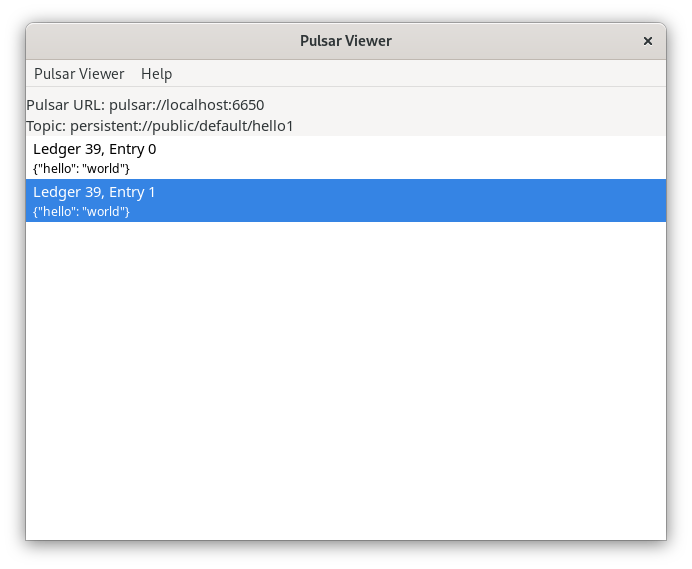

# pulsar-viewer

A simple desktop app for previewing the contents of Pulsar topics. Pulsar Viewer is a native, desktop app written in Python, powered by [toga](https://toga.readthedocs.io/en/stable/).



# Installation

With [pipx](https://github.com/pypa/pipx):

```bash
pipx install pulsar-viewer
```

# Usage

Run the CLI in your terminal:

```bash
pulsar-viewer --topic persistent://your_tenant/your_namespace/your_topic
```

A GUI window will open. Toga is supposed to support macOS, Linux, and Windows alike.

# Project Status

Experimental. Proof of concept. UI improvements will come later if I confirm this makes sense as a development utility.

# Development

## Installation

System packages required on Fedora:

```bash
sudo dnf install gcc gobject-introspection-devel cairo-gobject-devel pkg-config python3-devel gtk4
```

Alternatively, check the [docs for installing pygobject](https://pygobject.gnome.org/getting_started.html).


Project deps:

```bash
rye sync
```

## Running tests

```bash
make test-all
```
